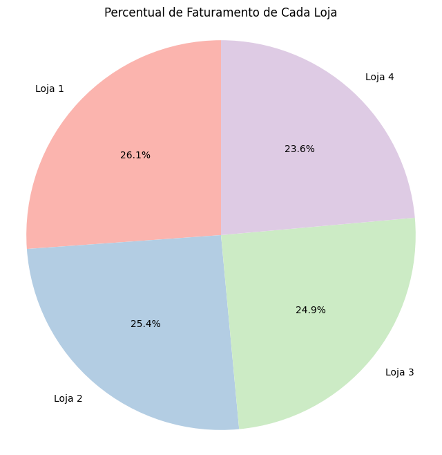

# 📊 Análise de Vendas Alura Store: Recomendação Estratégica

## 🎯 Objetivo do Projeto

Este projeto tem como objetivo principal auxiliar o Senhor João, proprietário da rede Alura Store, a tomar uma decisão estratégica: em qual das quatro lojas existentes ele deve iniciar um novo empreendimento?

Para isso, realizamos uma análise aprofundada dos dados de vendas, desempenho financeiro, satisfação do cliente, evolução trimestral e distribuição geográfica das 4 lojas fictícias da rede. O foco da análise foi identificar a loja com a menor eficiência para que o novo empreendimento possa atuar como um projeto de revitalização e otimização.

---

## 🛠️ Tecnologias Utilizadas

- **Python**: Linguagem principal para manipulação e análise de dados.
- **Pandas**: Biblioteca essencial para estruturação e processamento dos dados.
- **Matplotlib**: Utilizada para a criação de visualizações estáticas (gráficos de barras, linhas e dispersão).
- **Folium**: Utilizada para a criação de visualizações geográficas interativas (Heatmap).

---

## 📈 Análise de Desempenho

A análise comparativa das lojas revelou a seguinte performance nas métricas financeiras e de satisfação:

| Loja   | Total de Vendas (R$) | Ticket Médio (R$) | Avaliação Média | Frete Médio (R$) |
|--------|---------------------:|------------------:|----------------:|-----------------:|
| Loja 1 |        1.534.509,12 |            650,49 |            3.98 |            34,69 |
| Loja 2 |        1.488.459,06 |            630,97 |            4.04 |            33,62 |
| Loja 3 |        1.464.025,03 |            620,61 |            4.05 |            33,07 |
| Loja 4 |        1.384.497,58 |            587,15 |            4.00 |            31,28 |

---

## 🖼️ Visualizações Chave

Para uma compreensão visual dos resultados, foram gerados os seguintes gráficos:

## 📊 Visualizações e Análises

Este projeto apresenta três visualizações principais para análise do desempenho das lojas Alura Store:

### 1. Percentual de Faturamento de cada Loja

Gráfico de pizza mostrando quanto cada loja corresponde do faturamento total das lojas Alura Store, permitindo identificar rapidamente quais unidades têm maior participação nas receitas.

### 2. Vendas Trimestrais

Gráfico de linha mostrando a evolução do faturamento de cada loja ao longo dos trimestres, facilitando a análise de tendências e sazonalidade nas vendas.

### 3. Distribuição Geográfica das Vendas

Gráfico de dispersão que ilustra o alcance e a concentração das vendas por localização, ajudando a compreender a distribuição geográfica do desempenho das lojas.

---

## 💡 Resumo da Recomendação Final

Com base na análise de desempenho financeiro, satisfação do cliente, evolução temporal e perfil geográfico, a Loja 4 é a loja com a menor eficiência da rede.

**Recomendação:** A Loja 4 deve ser considerada para VENDA.

**Justificativa:** A venda da Loja 4 permite que o Senhor João realoque capital e esforços para as lojas mais promissoras (1, 2 e 3) ou invista em outro negocio, maximizando o retorno sobre o investimento e otimizando a performance geral da rede Alu
